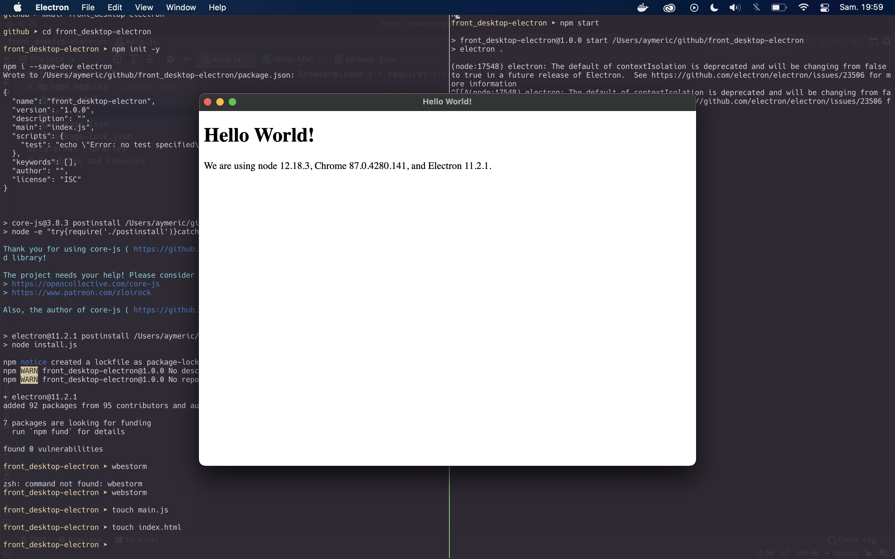
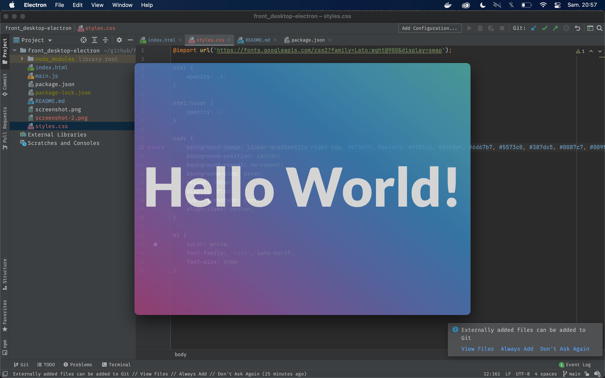

# Quick Start Electron

source: https://www.electronjs.org/docs/tutorial/quick-start

```
npm run start
```

## first commit



## second commit


## third commit


```javascript
const win = new BrowserWindow({
    width: 800,
    height: 600,
    webPreferences: {
        nodeIntegration: true
    },
    frame: false,
    transparent: true,
    frame: false,
    hasShadow: false,
    fullscreenable: false,
    alwaysOnTop: true,
    resizable: false,
    minimizable: false,
    maximizable: false,
    transparent: true,
    titleBarStyle: 'customButtonsOnHover',
    closable: false,
    webPreferences: {
        nodeIntegration: true,
        webSecurity: false,
    },
})
```
